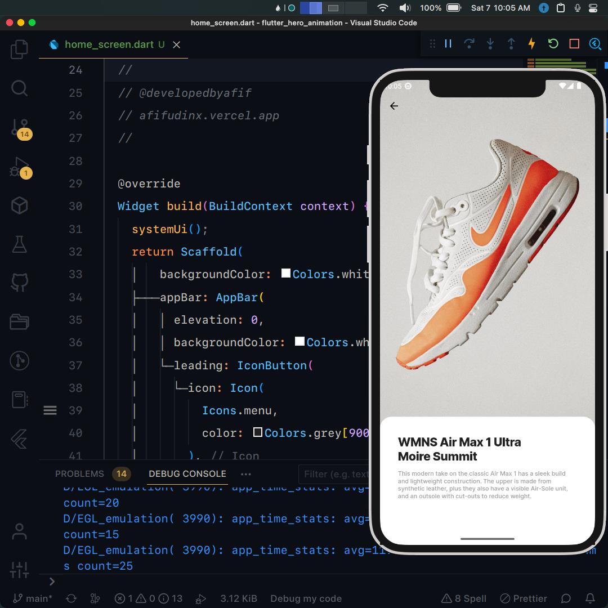

## Flutter UI - Hero Animation

```dart
void main() => runApp(MaterialApp(
      debugShowCheckedModeBanner: false,
      initialRoute: '/',
      onGenerateRoute: ((settings) {
        final arguments = settings.arguments;
        if (settings.name == '/detail') {
          DetailScreenArguments args = arguments as DetailScreenArguments;
          return RouteAnimation.slide(
              settings, DetailScreen(image: args.image));
        } else {
          return RouteAnimation.slide(settings, const HomeScreen());
        }
      }),
    ));
```

## Development Setup
```
git clone https://github.com/afifudinx/flutter-hero-animation.git
cd flutter-hero-animation
flutter pub get
flutter run
```

## Screenshots


## Links

* [Website](https://afifudinx.vercel.app)
* [Youtube channel](https://youtube.com/developedbyafif)
* [Instagram](https://instagram.com/developedbyafif)
